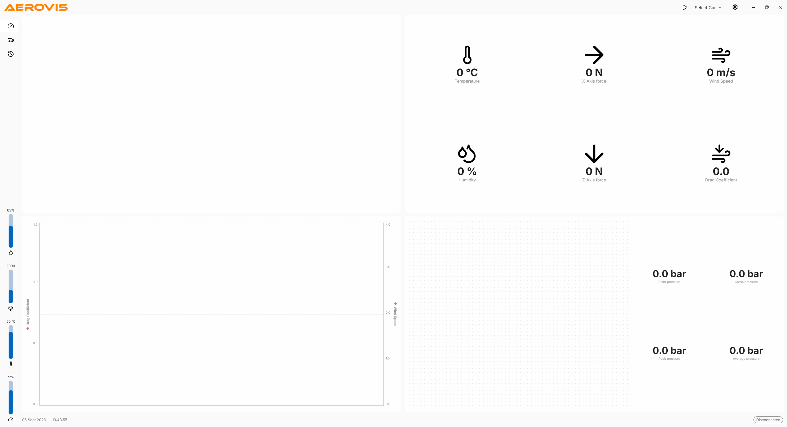

# AeroVisApp



AeroVisApp is a Windows desktop application (WPF, .NET) built to drive and visualize experiments on the **Aero wind tunnel**. It provides a single operator console for configuring a test run, controlling the tunnel hardware, and observing live aerodynamic measurements as they are captured from the test section.

## Purpose

The Aero wind tunnel is used to study how air interacts with a model mounted in the test section — measuring forces, pressures, and environmental conditions across a range of wind speeds. AeroVisApp is the human-facing side of that setup: it turns raw sensor streams into a readable, real-time dashboard and gives the operator the controls needed to run repeatable experiments without touching the underlying hardware directly.

Typical use cases include:

- Running guided flight-style scenarios (Free Flight, Circuit Training, Cross Country, Formation Flying) or fully custom test profiles.
- Sweeping wind speed and throttle to characterize a model's aerodynamic behavior.
- Recording drag coefficient, axial forces, wind speed, temperature, humidity, and pressures for later analysis.
- Comparing runs from the simulation history to iterate on a model or a test setup.

## Features

- **Live telemetry dashboard** — temperature, X- and Z-axis forces, wind speed, humidity, drag coefficient, and pressure readings updated in real time.
- **Charts** — live plots of drag coefficient and wind speed over the duration of the run.
- **Tunnel control** — start/stop the run, control throttle and fogger, and pick from preset scenarios or a custom profile.
- **Session timer** — tracks the length of each experiment.
- **Settings**
  - *General*: dark mode.
  - *Device*: throttle sensitivity, fogger power.
  - *Data*: simulation history.
- **Modern UI** — WPF + WPF-UI, with light and dark themes and a splash screen on startup.


## Project Structure

```
AeroVisApp/
├── AeroVisApp.sln
└── AeroVisApp/
    ├── App.xaml / App.xaml.cs        // Application entry point
    ├── SplashWindow.xaml(.cs)        // Startup splash
    ├── MainWindow.xaml(.cs)          // Main dashboard: telemetry, charts, controls
    ├── SettingsWindow.xaml(.cs)      // General / Device / Data settings
    ├── AppSettings.cs                // Persisted user settings model
    ├── ThemeManager.cs               // Light/dark theme handling
    └── res/                          // Icons and SVG assets
```

## Requirements

- Windows 10/11
- .NET SDK matching the target framework of `AeroVisApp.csproj`
- A connected Aero wind tunnel (or a compatible data source) for live readings

## Build & Run

From the repository root:

```powershell
dotnet build AeroVisApp.sln
dotnet run --project AeroVisApp\AeroVisApp.csproj
```

Or open `AeroVisApp.sln` in Visual Studio / JetBrains Rider and run the `AeroVisApp` project.

## Notes

Values shown in the UI without a connected tunnel are placeholders. Once the tunnel is connected and streaming, the dashboard reflects live measurements from the test section.
